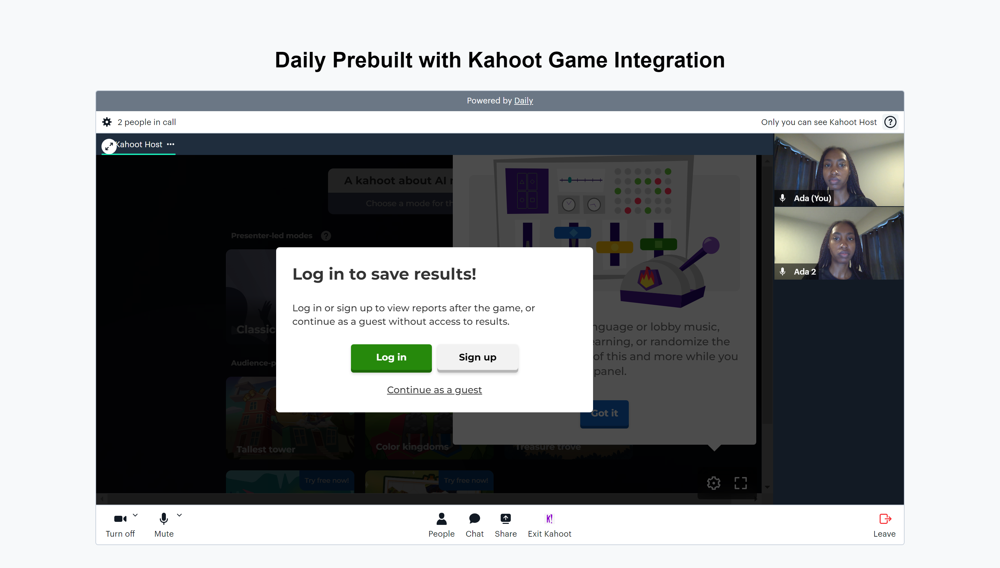

# Daily Prebuilt + Kahoot Integration Demo

This demo integrates Kahoot directly into a Daily Prebuilt video call. 

## Prerequisites

- [Sign up for a Daily account](https://dashboard.daily.co/signup).
- [Create a Daily room](https://dashboard.daily.co/rooms/create) and copy the resulting room URL.
- 
## How the demo works

This demo uses Daily Prebuilt to integrate a game of Kahoot for participants. Any participant can start a game. Once a game is started, other participants can join it using the PIN provided by the host.

The host should enable the "Show questions and answers" option inside the Kahoot game UI. This ensures participants can see each question and its answer options without the host having to share their screen.

## Running locally

1. Run `git clone git@github.com:daily-demos/daily-kahoot.git`
1. Run `cd daily-kahoot`
1. Paste your Daily room URL into the `roomUrl` const in `src/script.js`
1. Run `npm i`
1. Run `npm run start`
1. Open the displayed localhost port in your web browser in at least two tabs (or with some friends!) and click "Join room".
1. Click "Start Kahoot", enable the "Show questions and answers" option in game settings, and play!

## Contributing and feedback

Contributions are welcome in the form of GitHub issues or pull requests.

## Related blog posts/guides

* Daily's [Integrations documentation](https://docs.daily.co/reference/daily-js/instance-methods/set-custom-integrations)
* [New Prebuilt Integrations API: Easily add your favorite apps to Daily’s video call embed](https://www.daily.co/blog/new-prebuilt-integrations-api-easily-add-your-favorite-apps-to-dailys-video-call-embed/)
* [Integrate Miro and CometChat in a Daily video call with our new Prebuilt Integrations API](https://www.daily.co/blog/integrate-miro-and-cometchat-in-a-daily-video-call-with-our-new-prebuilt-integrations-api/)